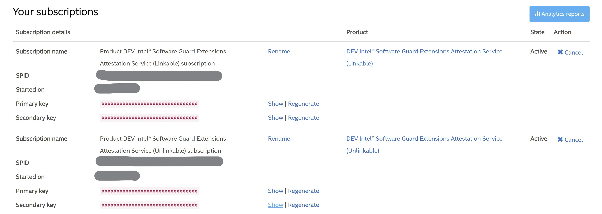

# DedupSGX
## Introduction
## System Design
## Installation Guide

#### Message Queue
* [Read Wtire Queue](https://github.com/cameron314/readerwriterqueue)

## Uasge Samples# Accelerating Encrypted Deduplication via SGX

## Introduction

Encrypted deduplication preserves the deduplication effectiveness on encrypted data and is attractive for outsourced storage.  However, existing encrypted deduplication approaches build on expensive cryptographic primitives that incur substantial performance slowdown.  We present SGXDedup, which leverages Intel SGX to speed up encrypted deduplication based on server-aided message-locked encryption (MLE) while preserving security via SGX.  SGXDedup implements a suite of secure interfaces to execute MLE key generation and proof-of-ownership operations in SGX enclaves.  It also proposes various designs to support secure and efficient enclave operations.  Evaluation of synthetic and real-world workloads shows that SGXDedup achieves significant speedups and maintains high bandwidth and storage savings.

## Publication

* Yanjing Ren, Jingwei Li, Zuoru Yang, Patrick P. C. Lee, and Xiaosong Zhang. Accelerating Encrypted Deduplication via SGX. In Proc of USENIX Annual Technical Conference (USENIX ATC 2021), July 2021.

## Prerequisites

We tested SGXDedup based on the Ubuntu 18.04.5 LTS version on a device with a Gigabyte B250M-D3H motherboard and an Intel i5-7400 CPU. 

Before everything starts, please check whether your device supports Intel SGX. Generally, the 7th generation and later Intel Core processors and their corresponding motherboards can enable the SGX function. Specifically, check whether there is an option marked as `SGX` or `Intel Software Guard Extensions` in your BIOS. If there is, adjust it to `Enable`, otherwise your device may not support the SGX function. We strongly recommend that you find a device that meets the requirements through [SGX-hardware list (Third-party on Github, click here)](https://github.com/ayeks/SGX-hardware).

After the device availability check is completed and the SGX function is successfully turned on in the BIOS, we begin preparations for SGXDedup compilation and execution.

### Registration in Intel for Remote Attestation Service

Since SGXDedup needs to use the `EPID based Remote Attestation` service provided by Intel, before starting, users need to register at [EPID-attestation page (click here)](https://api.portal.trustedservices.intel.com/EPID-attestation) to obtain the corresponding EPID and its corresponding subscription key.

After completes the registration, you can obtain the required EPID and subscription key through the [Products page (click here)](https://api.portal.trustedservices.intel.com/products) page. Here, our test uses the `DEV Intel® Software Guard Extensions Attestation Service (Unlinkable)` version of the service (users can also choose `Intel® Software Guard Extensions Attestation Service (Unlinkable)`). As shown in the figure below, the EPID and the corresponding subscription keys (Primary key and Secondary key) can be obtained, we will use this information in the configuration later.



### List of Dependents and Documents

Here we give the download and installation method of each dependency. At the same time, in the `Packages/` directory of this project, the pre-downloaded version is provided. At the same time, in the `Docs/Guides/` directory, we give all the third-party documentation mentioned in this configuration guide.

#### Packages that need to be manually configured 

1. Intel® Software Guard Extensions (Intel® SGX) driver version 2.6.0_4f5bb53 [Download Link](https://download.01.org/intel-sgx/sgx-linux/2.7/distro/ubuntu18.04-server/sgx_linux_x64_driver_2.6.0_4f5bb63.bin), [Local Address](./Packages/sgx_linux_x64_driver_2.6.0_4f5bb63.bin)
2. Intel® SGX platform software (Intel® SGX PSW) version 2.7.100.4 [Download Link](https://download.01.org/intel-sgx/sgx-linux/2.7/distro/ubuntu18.04-server/libsgx-enclave-common_2.7.100.4-bionic1_amd64.deb), [Local Address](./Packages/libsgx-enclave-common_2.7.100.4-bionic1_amd64.deb)
3. Intel® SGX SDK version 2.7.100.4 [Download Link](https://download.01.org/intel-sgx/sgx-linux/2.7/distro/ubuntu18.04-server/sgx_linux_x64_sdk_2.7.100.4.bin), [Local Address](./Packages/sgx_linux_x64_sdk_2.7.100.4.bin)
4. Intel® SGX SSL version lin_2.5_1.1.1d [Download Link](https://github.com/intel/intel-sgx-ssl/archive/refs/tags/lin_2.5_1.1.1d.zip), [Local Address](./Packages/lin_2.5_1.1.1d.zip)
5. OpenSSL version 1.1.1d [Donwload Link](https://www.openssl.org/source/old/1.1.1/openssl-1.1.1d.tar.gz), [Local Address](./Packages/openssl-1.1.1d.tar.gz)
6. The cmake module used to compile the SGX program in the cmake system: [Download Link](https://github.com/xzhangxa/SGX-CMake/blob/master/cmake/FindSGX.cmake), [Local Address](./Packages/FindSGX.cmake)

#### Packages installed through the package management tool

1. libssl-dev (For SGXDedup encryption algorithm)
2. libcurl4-openssl-dev (Required by SGX packages)
3. libprotobuf-dev (Required by SGX packages)
4. libboost-all-dev (For SGXDedup multithreading, message transmission, etc.)
5. libleveldb-dev (For SGXDedup deduplication index based on LevelDB)
6. libsnappy-dev (Required by LevelDB)
7. build-essential (Basic program compilation environment)
8. cmake (CMake automated build framework)
9. wget (System components used for remote attestation requests)

#### Third-party Documents

1. [SGX Compact Hardwares List](Docs/Guides/SGXHardwares.md)
2. [Intel SGX Environment Install Guide](Docs/Guides/Intel_SGX_Installation_Guide_Linux_2.7_Open_Source.pdf)
3. [Intel SGX SSL Install Guide](Docs/Guides/Intel-SGX-SSL.md)

### Manual installation
#### Install Compilation Environment

SGXDedup is compiled and generated through the CMake system. We first install the compiler and other environments required for compilation and execution: 

```shell 
sudo apt install build-essential cmake wget libssl-dev libcurl4-openssl-dev libprotobuf-dev libboost-all-dev libleveldb-dev libsnappy-dev
```

Then we put the downloaded `FindSGX.cmake` into the modules directory under the cmake directory. In Ubuntu 18.04, the path should be `/usr/share/cmake-3.10/Modules`:  

```shell
cp FindSGX.cmake /usr/share/cmake-3.10/Modules/
```

#### Install SGX Related Packages

In the current version (v1.0) of SGXDedup, we use the 2.7 version of the SGX SDK and the corresponding drivers and tools. These packages can be downloaded from [01.org (click here)](https://01.org/intel-softwareguard-extensions/downloads/intel-sgx-linux-2.7-release) 

Here, we download and install the following three software packages according to the [Official Installation Guide (click here)](https://download.01.org/intel-sgx/sgx-linux/2.7/docs/Intel_SGX_Installation_Guide_Linux_2.7_Open_Source.pdf) (page 5 to 10) provided by intel: 

1. Intel® Software Guard Extensions (Intel® SGX) driver [Download Link](https://download.01.org/intel-sgx/sgx-linux/2.7/distro/ubuntu18.04-server/sgx_linux_x64_driver_2.6.0_4f5bb63.bin)
2. Intel® SGX platform software (Intel® SGX PSW) [Download Link](https://download.01.org/intel-sgx/sgx-linux/2.7/distro/ubuntu18.04-server/libsgx-enclave-common_2.7.100.4-bionic1_amd64.deb)
3. Intel® SGX SDK [Download Link](https://download.01.org/intel-sgx/sgx-linux/2.7/distro/ubuntu18.04-server/sgx_linux_x64_sdk_2.7.100.4.bin)

After the three software packages are installed, we install the intel-sgx-ssl software package needed by SGXDedup according to the [official guide (click here to see)](https://github.com/intel/intel-sgx-ssl/tree/lin_2.5_1.1.1d). We use the [Linux 2.5 SGX SDK, OpenSSL 1.1.1d (click here to download)](https://github.com/intel/intel-sgx-ssl/archive/refs/tags/lin_2.5_1.1.1d.zip) version.

##### Example to Install SGX Environment with Ubuntu 18.04 LTS

For example, in ubuntu 18.04, we install the driver and PSW package according to the following commands. The packages will be installed into `/opt/intel` by default.

```shell
chmod +x sgx_linux_x64_driver_2.6.0_4f5bb63.bin
sudo ./sgx_linux_x64_driver_2.6.0_4f5bb63.bin
sudo dpkg -i ./libsgx-enclave-common_2.7.100.4-bionic1_amd64.deb
```

Finally, we install the SDK and configure environment variables by following commands.

```shell
chmod +x sgx_linux_x64_sdk_2.7.100.4.bin
sudo ./sgx_linux_x64_sdk_2.7.100.4.bin
source /opt/intel/sgxsdk/environment
```

Note that the default installation path of the SDK is the current path where the SDK package is located. The install program will alert you with 'Do you want to install in the current directory? [yes/no]'. Here we enter `no` when selecting the installation path, and then give the installation path `/opt/intel` to make sure that the three software packages are installed in the same path.

##### Example to Install SGX SSL with Ubuntu 18.04 LTS

First, we follow the steps of the official tutorial to install. In the first step, we decompress the downloaded intel-sgx-ssl package:

```shell
unzip intel-sgx-ssl-lin_2.5_1.1.1d.zip
```

In the second step, we copy the source code compression package of OpenSSL to the `intel-sgx-ssl-lin_2.5_1.1.1d/openssl_source/`, and enter the `intel-sgx-ssl-lin_2.5_1.1.1d/Linux/`

```shell
cp openssl-1.1.1d.tar.gz intel-sgx-ssl-lin_2.5_1.1.1d/openssl_source/
cd intel-sgx-ssl-lin_2.5_1.1.1d/Linux/
```

The third step is to execute the compilation and installation instructions:

```shell
make all
make test
sudo make install
```

After the execution is complete, intel-sgx-ssl will be installed in the `/opt/intel/sgxssl/` directory. Here, because intel-sgx-ssl introduces a custom header file `pthread.h`, which will interfere with the normal compilation of SGXDedup, we use the following simple method to correct it:

```shell
cd /opt/intel/sgxssl/include
sudo mv pthread.h sgxpthread.h
sudo sed -i '415c #include \"sgxpthread.h\"' /opt/intel/sgxssl/include/openssl/crypto.h
```

These commands modify the imported `pthread.h` file name to avoid the compilation error of SGXDedup.

### Automatic Configuration

To simplify the installation and configuration process, we provide a one-step script for installation. After confirming that the hardware environment supports SGX and the operating system is Ubuntu 18.04LTS, execute the following script to complete all configuration tasks.

```shell
./Scripts/environmentInstall.sh
```

**Note that after the installation is complete, you may need to restart the device. After restarting, check whether the `isgx` device appears in the `/dev` directory. If it does not appear, please reinstall the SGX driver manually, and restart the computer again until the `isgx` device appears.**

## SGXDedup Running Guide

### Configuration

SGXDedup is configured based on JSON. You can change its configuration without rebuilding. We show the default configuration (`./config.json`) of SGXDedup as follows.

```json
{
    "ChunkerConfig": {
        "_chunkingType": 1, // 0: fixed size chunking; 1: variable size chunking; 2: FSL dataset hash list; 3: MS dataset hash list
        "_minChunkSize": 4096, // The smallest chunk size in variable size chunking, Uint: Byte (Maximum size 16KB)
        "_avgChunkSize": 8192, // The average chunk size in variable size chunking and chunk size in fixed size chunking, Uint: Byte (Maximum size 16KB)
        "_maxChunkSize": 16384, // The biggest chunk size in variable size chunking, Uint: Byte (Maximum size 16KB)
        "_slidingWinSize": 256, // The sliding window size in variable size chunking, Uint: MB
        "_ReadSize": 256 // System read input file size every I/O operation, Uint: MB
    },
    "KeyServerConfig": {
        "_keyBatchSize": 4096, // Maximum number of keys obtained per communication
        "_keyEnclaveThreadNumber": 1, // Maximum thread number for key enclave
        "_keyServerRArequestPort": 1559, // Key server host port for receive key enclave remote attestation request 
        "_keyServerIP": [
            "127.0.0.1"
        ], // Key server host IP ()
        "_keyServerPort": [
            6666
        ], // Key server host port for client key generation
        "_keyRegressionMaxTimes": 1048576, // Key regression maximum numbers `n`
        "_keyRegressionIntervals": 25920000 // Time interval for key regression (Unit: seconds), used for key enclave. Should be consistent with "server._keyRegressionIntervals"
    },
    "SPConfig": {
        "_storageServerIP": [
            "127.0.0.1"
        ], // Storage server host IP
        "_storageServerPort": [
            6668
        ], // Storage server host port for client upload or download files
        "_maxContainerSize": 8388608 // Maximum space for one-time persistent chunk storage, Uint: Byte (Maximum size 8MB)
    },
    "pow": {
        "_quoteType": 0, // Enclave quote type, do not modify it 
        "_iasVersion": 3, // Enclave IAS version, do not modify it 
        "_iasServerType": 0, // Server IAS version, do not modify it
        "_batchSize": 4096, // POW enclave batch size (Unit: chunks)
        "_ServerPort": 6669, // The port on storage server for remote attestation
        "_enclave_name": "pow_enclave.signed.so", // The enclave library name to create the target enclave
        "_SPID": "", // Your SPID for remote attseation service
        "_PriSubscriptionKey": "", // Your Intel remote attestation service primary subscription key
        "_SecSubscriptionKey": "" // Your Intel remote attestation service secondary subscription key
    },
    "km": {
        "_quoteType": 0, // Enclave quote type, do not modify it 
        "_iasVersion": 3, // Enclave IAS version, do not modify it 
        "_iasServerType": 0, // Server IAS version, do not modify it
        "_ServerPort": 6676, // The port on storage server for remote attestation
        "_enclave_name": "km_enclave.signed.so", // The enclave library name to create the target enclave
        "_SPID": "", // Your SPID for remote attseation service
        "_PriSubscriptionKey": "", // Your Intel remote attestation service primary subscription key
        "_SecSubscriptionKey": "" // Your Intel remote attestation service secondary subscription key
    },
    "server": {
        "_RecipeRootPath": "Recipes/", // Path to the file recipe storage directory
        "_containerRootPath": "Containers/", // Path to the unique chunk storage directory
        "_fp2ChunkDBName": "db1", // Path to the chunk database directory
        "_fp2MetaDBame": "db2" // Path to the file recipe database directory
        "_raSessionKeylifeSpan": 259200000 // Time interval for key regression (Unit: seconds), used for storage server. Should be consistent with "KeyServerConfig._keyRegressionIntervals"
    },
    "client": {
        "_clientID": 1, // Current client ID 
        "_sendChunkBatchSize": 1000, // Maximum number of chunks sent per communication
        "_sendRecipeBatchSize": 100000 // Maximum number of file recipe entry sent per communication
    }
}
```

Note that before starting, you need to fill in the following content in `./config.json` (this information comes from intel, see [Registration in Intel for Remote Attestation Service](#Prerequisites))

```json
...
"pow": {
    ...
    "_SPID": "", // Your SPID for remote attseation service
    "_PriSubscriptionKey": "", // Your Intel remote attestation service primary subscription key
    "_SecSubscriptionKey": "" // Your Intel remote attestation service secondary subscription key
},
"km": {
    ...
    "_SPID": "", // Your SPID for remote attseation service
    "_PriSubscriptionKey": "", // Your Intel remote attestation service primary subscription key
    "_SecSubscriptionKey": "" // Your Intel remote attestation service secondary subscription key
},
...
```

### Build

Compile SGXDedup as follows. 

```shell
mkdir -p bin && mkdir -p build && cd build
cmake -DCMAKE_BUILD_TYPE=Release .. && make

cd ..
cp lib/*.a bin/
cp ./lib/pow_enclave.signed.so ./bin
cp ./lib/km_enclave.signed.so ./bin
cp config.json bin/
cp -r key/ bin/
mkdir -p bin/Containers && mkdir -p bin/Recipes
```

Alternatively, we provide a script for a quick build and clean-up, and you can use it.

```shell
chmod +x ./ShellScripts/*.sh
# Build SGXDedup in release mode
./ShellScripts/buildReleaseMode.sh
# Build SGXDedup in debug mode
./ShellScripts/buildDebugMode.sh
# Clean up build result
./ShellScripts/cleanBuild.sh
```

### Usage

You can test SGXDedup in a single machine, and connect the key manager, server (e.g., the cloud in the paper), and client instances via the local loopback interface. To this end, switch your current working directory to `bin/`, and start each instance in an independent terminal. Note that since the key enclave in the key manager needs to perform remote attestation to the cloud before it can be used, the user needs to start the server (`server-sgx`) first, then start the key manager (`keymanager-sgx`), and wait for `KeyServer : keyServer session key update done` log to appear on the key manager before starting the client.

```shell
./server-sgx
```

```shell
./keymanager-sgx
```

SGXDedup provides store and restores interfaces to clients.

```shell
# store file
./client -s file

# restore file
./client -r file
```